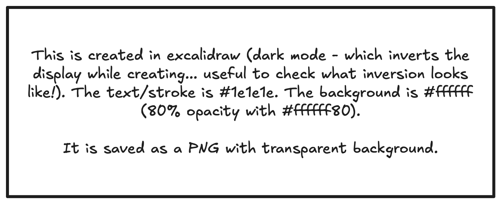
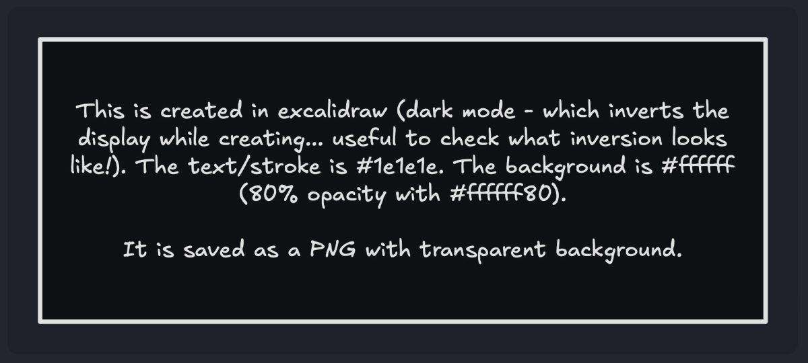
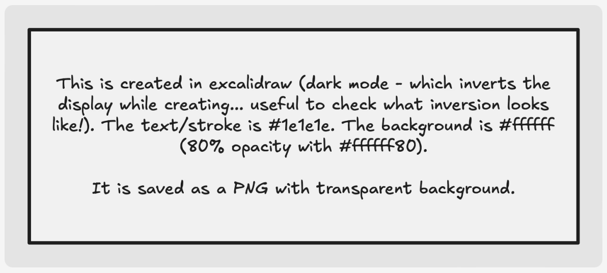

## Callouts

These callouts are fairly stock from [DaisyUI](https://daisyui.com/components/alert/), and use the standard theme warning, success, error, info colours:

<Info>Here's a bit of info for you!</Info>
<Warning>But be careful how you use it...</Warning>
<Error>This is what it'll look like when it goes wrong.</Error>
<Success>But the chance of success is often worth the risk!</Success>
<Alert>You just have to make sure you're always alert to the possibility.</Alert>

#### Usage:

```mdx
<Info>Here's a bit of info for you!</Info>
<Warning>But be careful how you use it...</Warning>
<Error>This is what it'll look like when it goes wrong.</Error>
<Success>But the chance of success is often worth the risk!</Success>
<Alert>You just have to make sure you're always alert to the possibility.</Alert>
```

## Blockquote with citation

A wrapper for markdown blockquotes, which allows you to set a citation (label and URL). For reference, this is a normal markdown blockquote:

> This is a normal markdown blockquote.
```markdown
> This is a normal markdown blockquote.
```
... and this is the `<Cite>` component:

<Cite>Cite component with no label or url set</Cite>
<Cite label="nought.">Cite component with only label set</Cite>
<Cite url="https://nought.vercel.app/custom-components">Cite component with only URL set (the cite attribute is set in HTML... you won't actually see it here).</Cite>
<Cite label="nought." url="https://nought.vercel.app/custom-components">Cite component with label and url set.</Cite>
<Cite label="nought." url="https://nought.vercel.app/custom-components" big>How about a more prominent quote?</Cite>

#### Usage:

```mdx showLineNumbers
<Cite>Cite component with no label or url set</Cite>
<Cite label="nought.">Cite component with only label set</Cite>
<Cite url="https://nought.vercel.app/custom-components">Cite component with only URL set (the cite attribute is set in HTML... you won't actually see it here).</Cite>
<Cite label="nought." url="https://nought.vercel.app/custom-components">Cite component with label and url set.</Cite>
```

## Diagrams

Custom component for displaying diagrams (or drawings, sketches, images). 
<Diag light='true'></Diag>

`light='true'` sets the diagram's lightness/darkness:

```mdx
<Diag light='true'></Diag>
```
This is how it is displayed on a dark theme:

And this is how it is displayed on a light theme:


<Todo content="Maybe more information needs to be added here" />

With `bg='no'`:
```mdx
<Diag light='true' bg='no'></Diag>
```
<Diag light='true' bg='no'></Diag>

Or override background colour:
```mdx
<Diag light='true' bg='#e9ef33'></Diag>
<Diag light='true' bg='bg-secondary'></Diag>
```
<Diag light='true' bg='#e9ef33'></Diag>
<Diag light='true' bg='bg-secondary'></Diag>

## Collapsible sections
<Todo>Maybe add some more about these collapse boxes. If there's a lot of content here, it will display ok in the actual Todo box, but will get truncated in the Todo link box at the top of the post, thanks to `line-clamp-2` TailwindCSS class.</Todo>
````mdx
<Collapse title="Default Styling">This is a collapsible section with default styling.</Collapse>

<Collapse title="Custom Styling 1" collapse_classes="!bg-base-300" title_classes="text-xl text-primary" content_classes="text-primary">
This is the content of section 1.
```mdx
here is some code inside the collapsible section.
```
</Collapse>

<Collapse title="Custom Styling 2" collapse_classes="!bg-base-100 shadow-secondary" title_classes="text-xl text-secondary" content_classes="text-secondary">This is the content of section 2.</Collapse>
````

<Collapse title="Default Styling">This is a collapsible section with default styling.</Collapse>
<Collapse title="Custom Styling 1" collapse_classes="!bg-base-300" title_classes="text-xl text-primary" content_classes="text-primary">
This is the content of section 1.
```mdx
here is some code inside the collapsible section.
```
</Collapse>
<Collapse title="Custom Styling 2" collapse_classes="!bg-base-100 shadow-secondary" title_classes="text-xl text-secondary" content_classes="text-secondary">This is the content of section 2.</Collapse>

## Keyboard keys

```mdx title="Separate KBD calls"
<KBD>Cmd</KBD> + <KBD>Shift</KBD> + <KBD>V</KBD>
```

<KBD>Cmd</KBD> + <KBD>Shift</KBD> + <KBD>V</KBD>

```mdx title="Single KBD call"
<KBD>K E Y B O A R D</KBD>
```

<KBD>K E Y B O A R D</KBD>

```mdx title="Use + for showing keyboard shortcuts"
A plus will be rendered with a space either side: <KBD>A + B</KBD>, <KBD>C+D</KBD>
```

A plus will be rendered with a space either side: <KBD>A + B</KBD>, <KBD>C+D</KBD>

```mdx title="-sym for symbols, instead of copy/pasting the symbol in"
This shortcut is <KBD>cmd-sym+shift-sym+B</KBD>

Without symbols, this is <KBD>cmd+shift+B</KBD>
```

This shortcut is <KBD>cmd-sym+shift-sym+B</KBD>

Without symbols, this is <KBD>cmd+shift+B</KBD>

```mdx title="Mixed spaces, commas and pluses"
<KBD>a b c, d, e + f     g h i</KBD>

// Spaces are collapsed to one space, commas have one space after, pluses have one space either side:
```
<KBD>a b c, d, e + f     g h i</KBD>

Feels like a bit of a cheat code, eh?

<KBD>up-sym+up-sym+down-sym+down-sym+left-sym+right-sym+left-sym+right-sym+B+A</KBD>